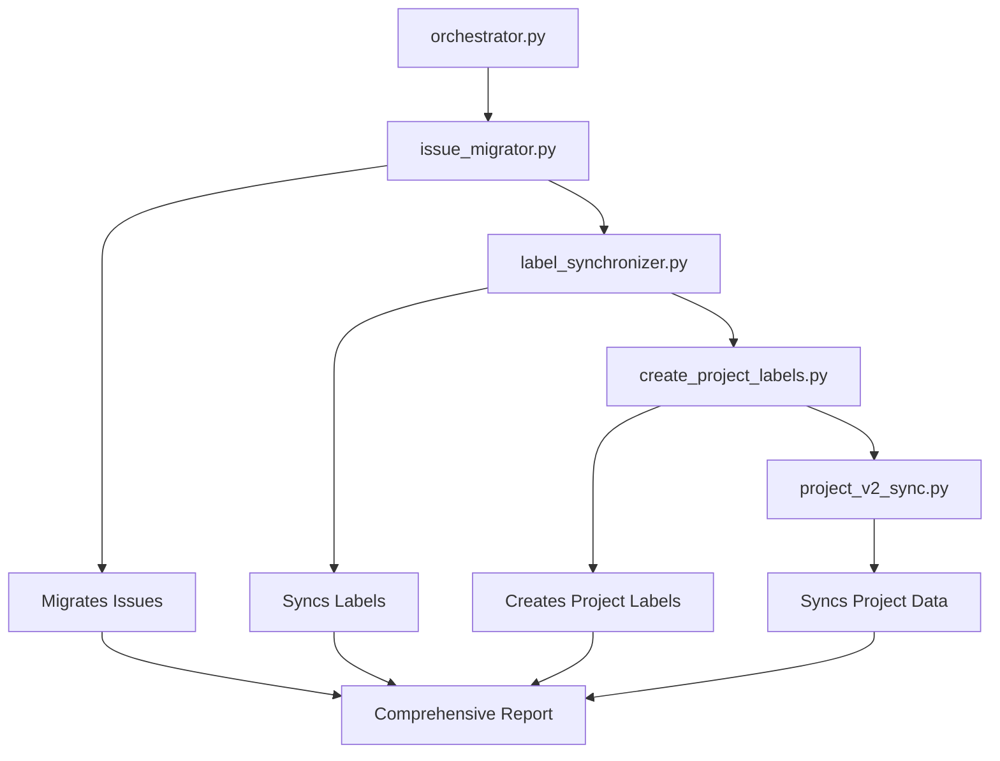

# GitHub Issue Migration Project

A comprehensive suite of Python scripts to migrate GitHub issues, labels, and project data between organizations or repositories.

## 🚀 Quick Start

### Prerequisites

1. **Python 3.7+** installed on your system
2. **GitHub Personal Access Token** with appropriate permissions:
   - `repo` scope for repository access
   - `project` scope for GitHub Projects V2 access
   - `admin:org` scope for organization-level operations

### Installation

1. Clone this repository and navigate to the project directory
2. Install dependencies:
   ```bash
   pip install -r requirements.txt
   ```

3. Create a `.env` file with your configuration:
   ```env
   GITHUB_TOKEN=your_github_token_here
   ORG_SOURCE=source-organization
   ORG_DEST=destination-organization  
   REPOS=repo1,repo2,repo3
   PROJECT=Your Project Name
   ```

### Usage

#### Option 1: Run the Orchestrator (Recommended)

Execute all migration scripts in the correct order:

```bash
python orchestrator.py
```

The orchestrator will:
- ✅ Validate your environment configuration
- 🔄 Execute all scripts in the proper sequence
- 📊 Provide a comprehensive execution report
- 🛡️ Continue execution even if individual scripts fail

#### Option 2: Run Individual Scripts

You can also run scripts individually in this order:

```bash
# 1. Migrate issues
python issue_migrator.py

# 2. Synchronize labels
python label_synchronizer.py

# 3. Create project labels
python create_project_labels.py

# 4. Sync project V2 data
python project_v2_sync.py
```

## 📋 Script Overview

### 1. Issue Migrator (`issue_migrator.py`)
**Purpose**: Migrates issues from source repositories to destination repositories.

**Features**:
- Preserves issue titles, descriptions, and assignees
- Maintains open/closed status
- Handles pagination for large repositories
- Prevents duplicate issues (matches by title)
- Synchronizes assignees between existing issues

### 2. Label Synchronizer (`label_synchronizer.py`)
**Purpose**: Synchronizes labels between migrated issues.

**Features**:
- Copies labels that exist in the destination repository
- Detects and preserves size-related labels (Size:, Story Points:, etc.)
- Maps project column information to labels (Project: Column Name)
- Filters out labels that don't exist in destination

### 3. Create Project Labels (`create_project_labels.py`)
**Purpose**: Creates labels for GitHub Projects V2 field options.

**Features**:
- Scans organization Projects V2 for field options
- Creates "Project: [Option]" labels with appropriate colors
- Supports both organization and user projects
- Color-codes labels based on common project states (TODO, In Progress, Done, etc.)

### 4. Project V2 Sync (`project_v2_sync.py`)
**Purpose**: Synchronizes GitHub Projects V2 items and field values.

**Features**:
- Adds migrated issues to destination project
- Synchronizes field values (Status, Size, Estimate, etc.)
- Handles single-select, number, and text field types
- Maps field options between source and destination projects

## 🔧 Configuration

### Environment Variables

| Variable | Description | Example |
|----------|-------------|---------|
| `GITHUB_TOKEN` | GitHub Personal Access Token | `ghp_xxxxxxxxxxxx` |
| `ORG_SOURCE` | Source organization name | `my-old-org` |
| `ORG_DEST` | Destination organization name | `my-new-org` |
| `REPOS` | Comma-separated list of repositories | `repo1,repo2,repo3` |
| `PROJECT` | Name of the GitHub Project V2 to sync | `My Project Board` |

### Token Permissions

Ensure your GitHub token has these scopes:
- ✅ `repo` - Repository access
- ✅ `project` - GitHub Projects V2 access  
- ✅ `admin:org` - Organization access (if migrating between orgs)

## 📊 Execution Report

The orchestrator provides a detailed execution report including:

- ⏱️ **Timing**: Total duration and per-script execution time
- 📈 **Success Rate**: Percentage of scripts that completed successfully
- 📋 **Detailed Results**: Status, duration, and output for each script
- 💡 **Recommendations**: Specific advice for fixing failed scripts

Example report output:
```
================================================================================
📊 MIGRATION ORCHESTRATOR EXECUTION REPORT
================================================================================
⏱️  Total Duration: 0:02:45.123456
🔢 Scripts Executed: 4
✅ Successful: 4
❌ Failed: 0
⚡ Total Script Time: 156.78 seconds
📈 Success Rate: 100.0%

────────────────────────────────────────────────────────────────────────────────
📋 DETAILED RESULTS
────────────────────────────────────────────────────────────────────────────────

1. ✅ ISSUE_MIGRATOR
   Duration: 45.67 seconds
   Status: SUCCESS
   Output (last 3 lines):
     ✅ 15 issues migrated successfully
     🏁 Migration completed for all repositories
     🎉 Issue migration process finished
```

## 🛠️ Troubleshooting

### Common Issues

1. **Missing Environment Variables**
   - Ensure all required variables are set in `.env`
   - Check variable names match exactly (case-sensitive)

2. **Authentication Errors**
   - Verify your GitHub token is valid and not expired
   - Ensure token has required scopes/permissions

3. **API Rate Limiting**
   - Scripts include basic rate limiting handling
   - For large migrations, consider running scripts individually with delays

4. **Project Not Found**
   - Verify project names match exactly (case-sensitive)
   - Ensure you have access to both source and destination projects

### Getting Help

- Check script logs for detailed error messages
- Run individual scripts to isolate issues
- Verify API access using curl or GitHub CLI
- Review GitHub's API documentation for permission requirements

## 🔄 Migration Flow



## 📝 Notes

- Scripts are designed to be idempotent (safe to run multiple times)
- The orchestrator continues execution even if individual scripts fail
- All scripts respect GitHub API rate limits and include error handling
- Project V2 sync requires the `PROJECT` environment variable to be set

## 🤝 Contributing

Feel free to submit issues, fork the repository, and create pull requests for any improvements.

## 📄 License

This project is provided as-is for educational and migration purposes.